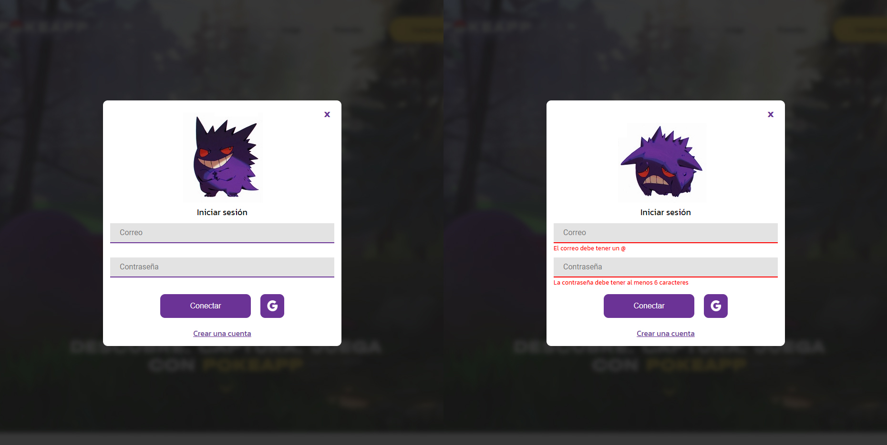
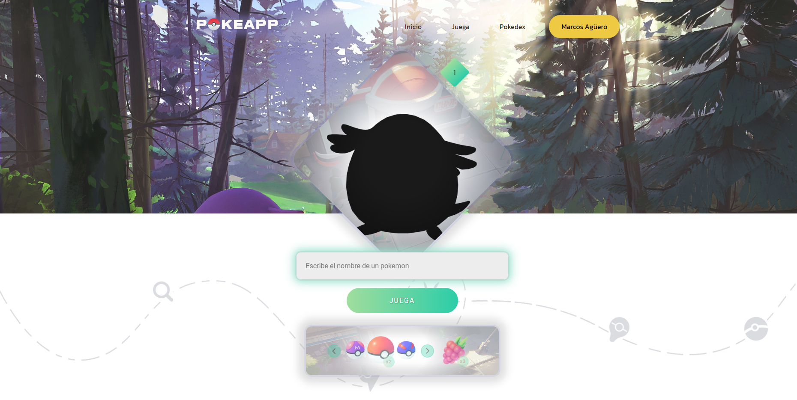
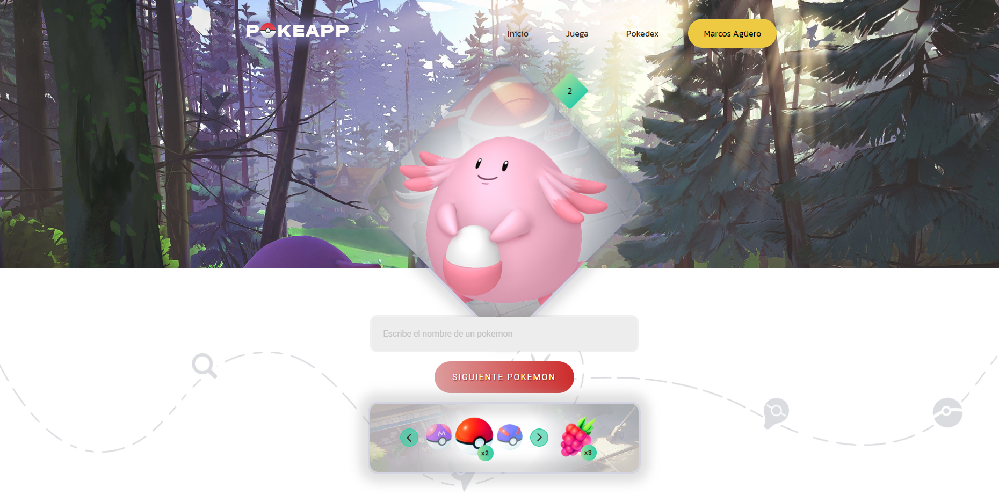
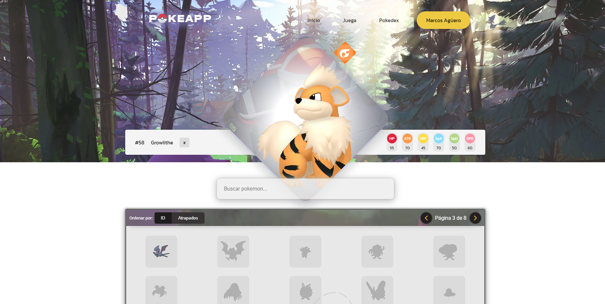
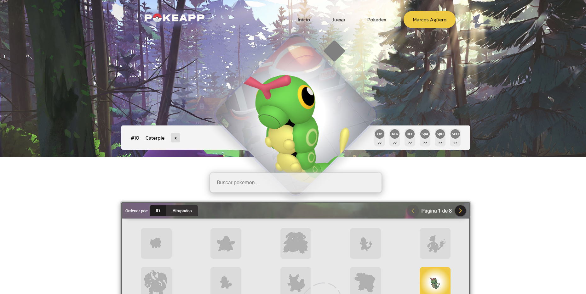

## POKEAPP</br>
### *Trabajo final Skill Factory Avalith*

Objetivo: tendrán que consumir algún API para brindar contenido a su aplicación, existen muchas gratuitas y de todo tipo. Se deberá crear una sección de favoritos, donde el usuario podrá almacenar información de esa API. Tendrán que utilizar Firestore, para administrar la base de datos de esta sección y utilizaran FireAuth para la autenticación de usuarios. También tendrán que utilizar un mínimo de 2 custom hooks.
</br>

* React.
* Redux Toolkit.
* React Router V6.
* SDK Firebase V9. 
* Axios.

---
### Links
* [ver demo](https://pokeapp-ashy.vercel.app)
* [portfolio (agmarcos.com)](https://agmarcos.com)

---

### Login y registro



* Autenticación con usuario y contraseña o cuenta de Google utilizando Firebase
* Manejo del estado del usuario con Redux Toolkit
* Rutas protegidas según el estado de conexión del usuario (React Router V6)

---

### Juego
El juego consiste en descubrir el pokemon que se encuentra oculto. Al escribir su nombre correctamente se habilita la funcionalidad de captura. 
Para atrapar un pokemon se puede lanzar una pokeball o una baya para facilitar la captura y posteriormente registrarlo en la pokedex.


 > Vista inicial del juego con el pokemon oculto y los items deshabilitados
 

> Al descubrir el pokemon oculto, se habilita la mochila del entrenador con sus items

* Datos de los pokemons obtenidos de la API de [PokeApi](https://pokeapi.co) utilizando Axios.
* Estado del juego mantenido en el LocalStorage.
* El inventario y los pokemon capturados se persisten con Firestore.
* Animaciones con Framer Motion.


En base a la cantidad de Pokemons descubiertos consecutivamente se obtienen distintas recompensas. Por ejemplo, la recompensa al adivinar 15 pokemons:
```

  "15" : {
    "pokeballs": 7,
    "superballs": 5,
    "ultraballs": 2,
    "berries": 6
  }

```

Para atrapar un Pokemon se utiliza la **experiencia base** del mismo obtenido desde la Api y se le resta un número basado en el item seleccionado (tipo de pokeball o baya). 
Cuando ese número llega a cero, el pokemon es capturable. 

Las pokeballs tienen efectividad, cada una dispone de un valor mínimo y máximo, permitiendo así que cierto pokemon necesite 1 o más tiradas para ser atrapado.

````
const ratio = 30;
const berries = 20;
const balls = {
  pokeballs: [1,3],
  superballs: [2,4],
  ultraballs: [4,7],
  masterballs: [10,10],
}

const randomNumber = (min, max) => { 
  return Math.floor(Math.random() * (max - min) + min);
} 

export const calcExperience = (base_experience, item) => {
  if(item === 'berries'){
    return base_experience - berries
  }else {
    const [min,max] = balls[item];
    return base_experience - ratio*randomNumber(min,max)
  }
}

````

---

### Pokedex
Todos los Pokemon vistos y atrapados se registran en la Pokedex, *cumpliendo con la funcionalidad requerida de una sección de Favoritos*.
La principal diferencia entre un pokemon atrapado de uno que simplemente fue visto está en que en el primer caso, toda su información está disponible (tipos y estadísticas).

* Manejo del estado de la pokedex con Redux Toolkit.
* Pokemons atrapados y vistos son guardados en Firestore.
* Paginación
* Búsqueda por nombre
* Orden de la pokedex por ID o Pokemon atrapados
* Animaciones con Framer Motion.


 > Vista de la pokedex con un pokemon capturado seleccionado.

 

 > Vista de la pokedex con un pokemon visto pero que no fue capturado.